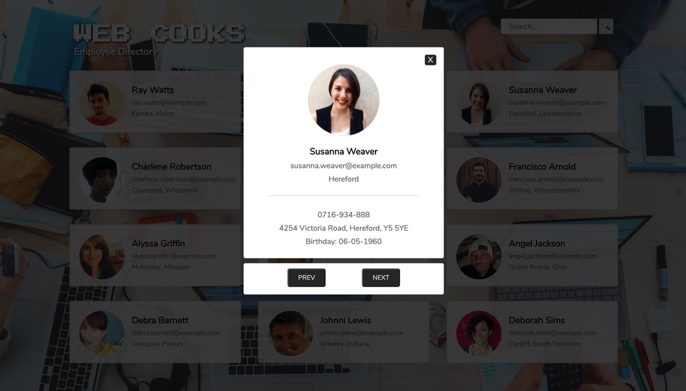

 

# TechDegree-Project-5

## Web Cooks - Public Api Request

## Live Demo

https://webdevbrum.github.io/TechDegree-Project-5/

## Getting Started

*No pre requisite installation required, built using Vanilla JavaScript*

App for a fictional company called Web Cooks, a distributed company with remote employees working all over the world. They need a smart way for employees to share contact information with each other.
 
Use of the Random User Generator API *(https://randomuser.me/)* to grab information for 12 random “employees,” and use that data to build a prototype for an Awesome Startup employee directory.
 
Request of a JSON object from the API and parse the data so that 12 employees are listed in a grid with their thumbnail image, full name, email, and location. Clicking the employee’s image or name will open a modal window with more detailed information, such as the employee’s birthday and address.
 
 